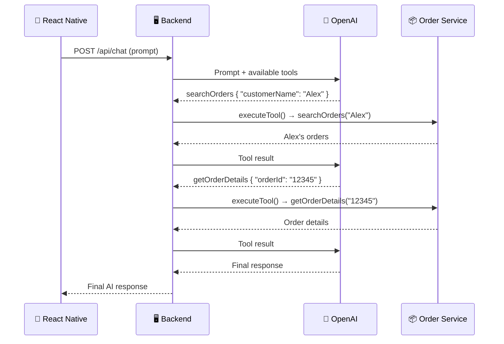
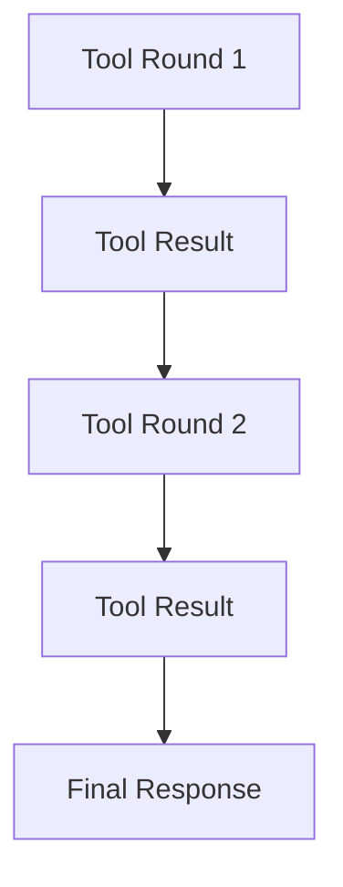
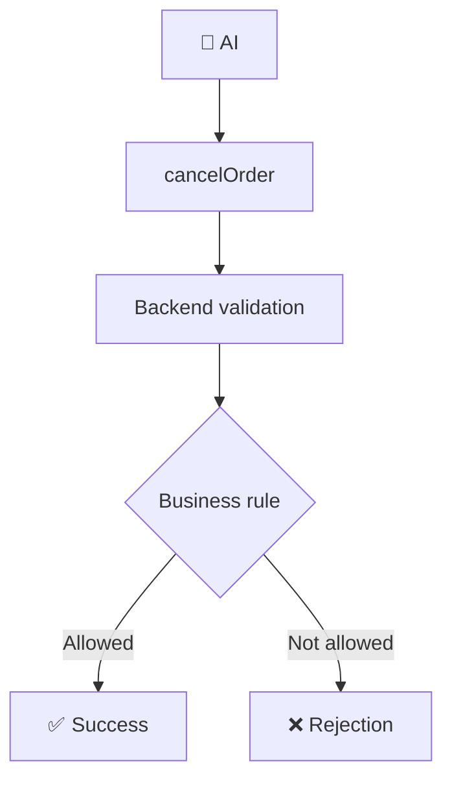

# 🤖 AI Order Assistant

### Experiment 03 — Part 2: Multi-Tool Calling


This experiment builds on **Experiment 03 — Part 1: Tool Calling** and extends the implementation into a more advanced **multi-tool AI workflow**.

The application is an **AI Order Assistant** that can search orders, retrieve order details, check order status, and cancel eligible orders.

---

## 📑 Table of Contents

- [Core Concept](#-core-concept)
- [What We Build](#-what-we-build)
- [How It Works](#-how-it-works)
- [Available Tools](#-available-tools)
- [Tool Chaining](#-tool-chaining)
- [Multiple Tool Calls](#-multiple-tool-calls)
- [Multi-Round Tool Calling](#-multi-round-tool-calling)
- [Action Tools](#-action-tools)
- [Backend Setup](#-backend-setup)
- [Test the Backend](#-test-the-backend)
- [Run the Mobile Application](#-run-the-mobile-application)
- [Security](#-security)
- [What We Learned](#-what-we-learned)
- [About Harihar Code Studio](#-about-harihar-code-studio)

---

## 💡 Core Concept

> **The AI decides which tool it needs. The application executes the tool.**

For action tools:

> **AI can request an action. The backend decides whether that action is allowed.**

Part 2 extends the Tool Calling workflow with:

- Multiple tools
- Multiple tool calls
- Tool chaining
- Multi-round tool execution
- Action tools
- Backend validation and business rules

---

## 🏗 What We Build

The application consists of two parts:

| Part | Stack |
| --- | --- |
| 📱 **Mobile app** | React Native / Expo |
| 🖥 **Backend** | Node.js / Express / TypeScript |

The backend communicates with OpenAI and is responsible for executing application-defined tools.

### Backend Responsibilities

1. Receiving the user's prompt.
2. Sending the prompt and available tools to OpenAI.
3. Reading the model's tool calls.
4. Executing the requested application functions.
5. Validating tool arguments.
6. Applying business rules.
7. Sending tool results back to OpenAI.
8. Continuing the workflow when additional tools are required.
9. Returning the final AI response to React Native.

---

## 🔄 How It Works

**Example prompt:**

> *Find Alex's orders and give me the full details of the order that is arriving today.*



---

## 🧰 Available Tools

| Tool | Type | Description | Returns |
| --- | --- | --- | --- |
| `getOrderStatus` | Read | Checks the status of an order | Order ID, current order status, estimated delivery |
| `getOrderDetails` | Read | Retrieves full order details | Customer, item, quantity, total, status, estimated delivery |
| `searchOrders` | Read | Searches for orders belonging to a customer | Matching orders |
| `cancelOrder` | **Action** | Cancels an order when backend business rules allow it | Success / rejection |

**Examples**

- `searchOrders` → *"Find all orders for Alex."*
- `cancelOrder` → *"Cancel order 12348."*

> [!IMPORTANT]
> An order that is already **shipped** or **out for delivery** cannot be cancelled.

---

## 🔗 Tool Chaining

Part 2 demonstrates how **one tool result can lead to another tool call**.

> *Find Alex's orders and give me the full details of the order that is arriving today.*

1. The AI first requests **`searchOrders`**.
2. The result identifies the order arriving today.
3. The AI then requests **`getOrderDetails`**.

This allows the AI to complete multi-step requests dynamically.

---

## 🧩 Multiple Tool Calls

The AI can request **multiple tools in the same round**.

> *Give me the status of order 12345 and the complete details of order 12346.*

The AI can request:

- `getOrderStatus`
- `getOrderDetails`

The backend executes both tools and sends the results back to OpenAI.

---

## 🔁 Multi-Round Tool Calling

Tool execution can continue across multiple rounds.



> [!NOTE]
> The implementation supports a maximum of **5 tool rounds**.

---

## ⚡ Action Tools

`cancelOrder` demonstrates an **action-oriented tool**. The AI can request an order cancellation, but the backend determines whether the operation is allowed.



This keeps application logic and business rules under backend control.

---

## 🚀 Backend Setup

Navigate to the server:

```bash
cd server
```

Install dependencies:

```bash
npm install
```

Create a `.env` file:

```env
OPENAI_API_KEY=your_openai_api_key_here
```

Start the development server:

```bash
npm run dev
```

The server runs on **http://localhost:3000**

---

## 🧪 Test the Backend

**Health Check**

```bash
curl http://localhost:3000/health
```

**Search Orders**

```bash
curl -X POST http://localhost:3000/api/chat \
  -H "Content-Type: application/json" \
  -d '{"prompt":"Find all orders for Alex."}'
```

**Tool Chaining**

```bash
curl -X POST http://localhost:3000/api/chat \
  -H "Content-Type: application/json" \
  -d '{"prompt":"Find Alex'\''s orders and give me the full details of the order that is arriving today."}'
```

**Cancel Order**

```bash
curl -X POST http://localhost:3000/api/chat \
  -H "Content-Type: application/json" \
  -d '{"prompt":"Cancel order 12348."}'
```

---

## 📱 Run the Mobile Application

Navigate to the mobile application:

```bash
cd mobile
```

Start Expo:

```bash
npx expo start
```

The mobile application sends the user's request to:

```http
POST /api/chat
```

The backend handles the complete Tool Calling workflow.

---

## 🔐 Security

> [!WARNING]
> - The OpenAI API key belongs on the **backend**.
> - The React Native application should **not** contain the OpenAI API key.
> - The `.env` file should **never** be committed to Git.

---

## 📚 What We Learned

- [x] Multiple application tools
- [x] Tool selection
- [x] Multiple tool calls
- [x] Tool chaining
- [x] Multi-round Tool Calling
- [x] Action tools
- [x] Argument validation
- [x] Backend business rules
- [x] React Native integration
- [x] Server-side API key security
- [x] Keeping application logic under backend control

---

## ✅ Experiment Status

**Experiment 03 — Part 2: Completed**

### ⏭ Next

The next experiment will build on these Tool Calling concepts and explore another practical AI application pattern.

---

## 🎓 About Harihar Code Studio

**Harihar Code Studio** focuses on practical software engineering tutorials covering:

`React Native` · `Mobile Engineering` · `Artificial Intelligence` · `LLM Integrations` · `AI Architecture` · `Developer Tools` · `Production Engineering`

The goal is to understand not only **how** to implement a feature, but also the **architecture and engineering decisions** behind it.
